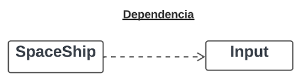
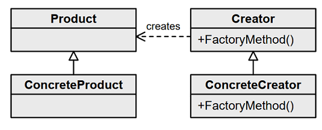

# Patrones de Diseño

---


**Referencias:**

- [**Refactoring.guru**](https://refactoring.guru/es/design-patterns/java)
- [**JavaTechOnline**](https://javatechonline.com/java-design-patterns-java/)

---

## Guía de flechas del diagrama de clase UML

**Referencias**

- [**UML Class Diagram Arrows Guide**](https://paulrumyancev.medium.com/uml-class-diagram-arrows-guide-37e4b1bb11e)
- [**UML Cheatsheet | Class Diagram Resource**](https://khalilstemmler.com/articles/uml-cheatsheet/)

### Asociación

``Las asociaciones representan los atributos en las clases.``

Una asociación **refleja la relación entre 2 clases.** Utilice la flecha Asociación cuando dos clases necesiten
comunicarse y una (o ambas) clase(s) **tengan referencia** a la segunda.  **La relación de asociación es "más fuerte"
que la relación de dependencia**, implica una conexión más estrecha entre entidades.

A continuación se muestra la **relación de Asociación Unidireccional**, donde **Player** puede llamar a las propiedades
y/o métodos de **HealthBar** pero no al revés.


````java
public class Player {

    private HealthBar healthBar; //<-- En asociación como atributo de la clase 
    private Vector3 position;

    public Player() {
        this.healthBar = new HealthBar();
    }

    public void update() {
        this.healthBar.followObject(this.position);
    }

    public void OnHealthChanged(float health) {
        this.healthBar.setHealth(health);
    }
}
````

En este caso la **relación de asociación es Bidireccional**, donde **A y B se llaman**.


### Asociación de Agregación

``Las asociaciones representan los atributos en las clases.``

**La agregación es un tipo especial de asociación** donde existen dos lados: **El Todo y la Parte.**

La agregación implica que se asocian 2 clases, aporta más detalles sobre la naturaleza de la relación. **La Parte puede
existir independientemente del Todo.**


El código siguiente es similar al anterior, y eso es normal, ya que dijimos que la **agregación es un tipo especial de
asociación**, aunque más adelante veremos una diferencia más significativa relacionada con la cardinalidad. De todas
maneras el diagrama que estamos usando es distinto, el diagrama con el rombo sin relleno indica una asociación de
**agregación**.

Si observamos bien, la clase **HealthBar** puede existir independientemente de la clase Player.

````java
public class Player {

    private HealthBar healthBar; //<-- En asociación como atributo de la clase
    private Vector3 position;

    public Player() {
        this.healthBar = new HealthBar();
    }

    public void update() {
        this.healthBar.followObject(this.position);
    }

    public void OnHealthChanged(float health) {
        this.healthBar.setHealth(health);
    }
}
````

A continuación mostramos otro ejemplo, donde observamos que **el controlador puede existir independientemente de la
vista.**


````java
public class AddUserView {

    private AddUserController controller; //<-- En asociación como atributo de la clase
    private TextField userFullName;
    private TextField userEmail;

    public AddUserView(AddUserController viewController) {
        this.controller = viewController;
    }

    public void addButtonClick() {
        this.controller.add(this.userFullName, this.userEmail);
    }
}
````

Como mencionamos anteriormente, ahora mostraremos un ejemplo diferenciador más notorio con relación a la asociación que
vimos al inicio. La diferencia radica principalmente en que el uso de este tipo de flechas está relacionado con la
cardinalidad.

**A tiene 1 o más instancias de B. B puede sobrevivir si se elimina A**, como por ejemplo:

- Professor (1) tiene muchas classes (0..*) para enseñar.
- El estanque (0..1) tiene muchos patos (0..*). Los patos pueden sobrevivir si se destruye el estanque.


Veamos otro ejemplo; **la agregación muestra que una instancia de Foo posee instancias de Bar.** La agregación requiere
que las instancias de Foo tengan una variable miembro que mantendrá una referencia a un objeto Bar entre llamadas a
métodos. **El indicador de multiplicidad n se usa para mostrar cuántas instancias posee un objeto Foo**, por lo tanto
**n** puede ser:

- 0..1 Una instancia, puede ser una referencia nula
- 1 Una instancia, no puede ser nula
- 4 (u otro número): un número fijo de instancias
- ``*`` Múltiples instancias, deben estar en una matriz


````java
public class Foo {
    //En asociación como atributo de la clase
    private Bar bar0_1;             //n = 0..1
    private Bar bar1;               //n = 1, nunca deberá ser null
    private Bar bar1, bar2, bar3;   //n = 3
    private Bar[] barArray;         //n = 0..*
}
````

### Asociación de Composición

``Las asociaciones representan los atributos en las clases.``

Composición implica que dos clases están asociadas y agrega los siguientes detalles: dentro de una composición, **los
subobjetos (partes) dependen fuertemente de un todo**. Los objetos de los tipos **se instancian juntos y tienen un ciclo
de vida común.**


El jugador y el controlador de movimiento del jugador dependen en gran medida el uno del otro y juntos forman un todo
único.

````java
public class Player {

    private PlayerMovementController movement; //<-- En asociación como atributo de la clase

    public Player() {
        this.movement = new PlayerMovementController(this);
    }
}
````

````java
public class PlayerMovementController {

    private Player player; //<-- En asociación como atributo de la clase

    public PlayerMovementController(Player player) {
        this.player = player;
    }
}
````

Veamos otro ejemplo; **A tiene 1 o más instancias de B. B no puede sobrevivir si A es destruido.**, por ejemplo:

- El Usuario (1) tiene un Username (1). Los Usernames no pueden existir como partes separadas de un usuario en nuestra
  aplicación.


### Dependencia

``No representa un atributo de la clase como en las asociaciones, pero la clase lo necesita usar, por ejemplo dentro de
un método o como parámetro de entrada al método.``

La relación de dependencia implica que dos elementos dependen el uno del otro. **Se utiliza para reflejar que una clase
interactúa con otra, recibe una instancia de esta clase como parámetro de método.**

**En comparación con la asociación, la relación de dependencia es más débil.**

La clase **SpaceShip** depende de la clase **Input** ``si usa instancias de Input en algún punto de su código.`` Si la
interfaz pública de Input cambia alguna vez, es posible que sea necesario actualizar el código de SpaceShip. Tenga en
cuenta que esto no implica que **Input** dependa de **SpaceShip**; **Input** probablemente no sabe qué clases lo están
usando.



````java
public class SpaceShip {

    private Vecto2 position;
    private folat moveSpeed = 2;

    public void update(float deltaTime) {
        if (Input.rightArrowPressed()) { //<-- Usado dentro del método
            position.x += moveSpeed * deltaTime;
        }
        if (Input.leftArowPressed()) { //<-- Usado dentro del método
            position.x -= moveSpeed * deltaTime;
        }
    }
}
````

En el ejemplo siguiente mostramos cómo la clase de la que dependemos se coloca como parámetro del método:


````java
public class SpaceShip {

    private folat moveSpeed = 2;

    public void applyBooster(Booster booster) { //<--- Usado como parámetro del método
        this.moveSpeed += booster.speedBoost;
    }
}
````

### Implementación (Realización)

Es usado para representar la implementación de interfaces. En el ejemplo mostramos que **SpaceShip es una implementación
concreta de IGameElement**:


````java
public interface IGameElement {
    void update();
}
````

````java
public class SpaceShip implements IGameElement {
    @override
    public void update() {

    }
}
````

### Herencia (Generalización)

Es usado para representar la herencia de clases.


````java
public abstract class BaseCommand {
    void execute();
}
````

````java
public class SaveDataCommand extends BaseCommand {
    @override
    public void execute() {

    }
}
````

---

## Factory Method

Define una interfaz para crear un objeto, pero deja que las subclases decidan qué clase instanciar.



Factory Method es un patrón de diseño creacional que proporciona una interfaz para crear objetos en una superclase,
mientras permite a las subclases alterar el tipo de objetos que se crearán.


Ejemplo de **Refactoring.guru:**


La finalidad del patrón Factory Method es proporcionar una manera de crear objetos de diferentes tipos sin tener que
conocer los detalles específicos de su creación. Aunque puede parecer que se están agregando más clases, en realidad
este enfoque tiene varios beneficios:

1. **Desacoplamiento:** El Factory Method permite separar la creación de objetos de su uso. Esto significa que el
   cliente (quien necesita los objetos) no necesita conocer los detalles concretos de cómo se crean los objetos. Si en
   el futuro cambias la forma en que se crean los objetos, el cliente no se verá afectado siempre y cuando mantengas la
   misma interfaz.

2. **Abstracción:** Al trabajar con interfaces y clases abstractas para la creación y los productos, puedes proporcionar
   una capa de abstracción que facilita la expansión y mantenimiento del sistema. Puedes agregar nuevos tipos de
   productos y creadores sin afectar el código existente.

3. **Reusabilidad:** Al tener creadores separados para diferentes tipos de objetos, puedes reutilizar la lógica de
   creación en varios lugares dentro de tu aplicación. Si necesitas crear objetos similares en diferentes partes del
   sistema, puedes utilizar los mismos creadores.

4. **Flexibilidad:** El Factory Method te permite crear jerarquías de productos y creadores. Esto es especialmente útil
   cuando tienes productos relacionados que deben ser creados de manera coherente, pero también con variaciones en su
   implementación.

5. **Extensibilidad:** Si en el futuro necesitas agregar nuevos tipos de productos, puedes hacerlo creando una nueva
   clase concreta de producto y un correspondiente creador. Esto evita la necesidad de modificar el código existente.