# Patrones de Diseño

---


**Referencias:**

- [**Refactoring.guru**](https://refactoring.guru/es/design-patterns/java)
- [**JavaTechOnline**](https://javatechonline.com/java-design-patterns-java/)

---

## Guía de flechas del diagrama de clase UML

**Referencias**

- [**UML Class Diagram Arrows Guide**](https://paulrumyancev.medium.com/uml-class-diagram-arrows-guide-37e4b1bb11e)
- [**UML Cheatsheet | Class Diagram Resource**](https://khalilstemmler.com/articles/uml-cheatsheet/)

### Asociación

``Las asociaciones representan los atributos en las clases.``

Una asociación **refleja la relación entre 2 clases.** Utilice la flecha Asociación cuando dos clases necesiten
comunicarse y una (o ambas) clase(s) **tengan referencia** a la segunda.  **La relación de asociación es "más fuerte"
que la relación de dependencia**, implica una conexión más estrecha entre entidades.

A continuación se muestra la **relación de Asociación Unidireccional**, donde **Player** puede llamar a las propiedades
y/o métodos de **HealthBar** pero no al revés.


````java
public class Player {

    private HealthBar healthBar; //<-- En asociación como atributo de la clase 
    private Vector3 position;

    public Player() {
        this.healthBar = new HealthBar();
    }

    public void update() {
        this.healthBar.followObject(this.position);
    }

    public void OnHealthChanged(float health) {
        this.healthBar.setHealth(health);
    }
}
````

En este caso la **relación de asociación es Bidireccional**, donde **A y B se llaman**.


### Asociación de Agregación

``Las asociaciones representan los atributos en las clases.``

**La agregación es un tipo especial de asociación** donde existen dos lados: **El Todo y la Parte.**

La agregación implica que se asocian 2 clases, aporta más detalles sobre la naturaleza de la relación. **La Parte puede
existir independientemente del Todo.**


El código siguiente es similar al anterior, y eso es normal, ya que dijimos que la **agregación es un tipo especial de
asociación**, aunque más adelante veremos una diferencia más significativa relacionada con la cardinalidad. De todas
maneras el diagrama que estamos usando es distinto, el diagrama con el rombo sin relleno indica una asociación de
**agregación**.

Si observamos bien, la clase **HealthBar** puede existir independientemente de la clase Player.

````java
public class Player {

    private HealthBar healthBar; //<-- En asociación como atributo de la clase
    private Vector3 position;

    public Player() {
        this.healthBar = new HealthBar();
    }

    public void update() {
        this.healthBar.followObject(this.position);
    }

    public void OnHealthChanged(float health) {
        this.healthBar.setHealth(health);
    }
}
````

A continuación mostramos otro ejemplo, donde observamos que **el controlador puede existir independientemente de la
vista.**


````java
public class AddUserView {

    private AddUserController controller; //<-- En asociación como atributo de la clase
    private TextField userFullName;
    private TextField userEmail;

    public AddUserView(AddUserController viewController) {
        this.controller = viewController;
    }

    public void addButtonClick() {
        this.controller.add(this.userFullName, this.userEmail);
    }
}
````

Como mencionamos anteriormente, ahora mostraremos un ejemplo diferenciador más notorio con relación a la asociación que
vimos al inicio. La diferencia radica principalmente en que el uso de este tipo de flechas está relacionado con la
cardinalidad.

**A tiene 1 o más instancias de B. B puede sobrevivir si se elimina A**, como por ejemplo:

- Professor (1) tiene muchas classes (0..*) para enseñar.
- El estanque (0..1) tiene muchos patos (0..*). Los patos pueden sobrevivir si se destruye el estanque.


Veamos otro ejemplo; **la agregación muestra que una instancia de Foo posee instancias de Bar.** La agregación requiere
que las instancias de Foo tengan una variable miembro que mantendrá una referencia a un objeto Bar entre llamadas a
métodos. **El indicador de multiplicidad n se usa para mostrar cuántas instancias posee un objeto Foo**, por lo tanto
**n** puede ser:

- 0..1 Una instancia, puede ser una referencia nula
- 1 Una instancia, no puede ser nula
- 4 (u otro número): un número fijo de instancias
- ``*`` Múltiples instancias, deben estar en una matriz


````java
public class Foo {
    //En asociación como atributo de la clase
    private Bar bar0_1;             //n = 0..1
    private Bar bar1;               //n = 1, nunca deberá ser null
    private Bar bar1, bar2, bar3;   //n = 3
    private Bar[] barArray;         //n = 0..*
}
````

### Asociación de Composición

``Las asociaciones representan los atributos en las clases.``

Composición implica que dos clases están asociadas y agrega los siguientes detalles: dentro de una composición, **los
subobjetos (partes) dependen fuertemente de un todo**. Los objetos de los tipos **se instancian juntos y tienen un ciclo
de vida común.**


El jugador y el controlador de movimiento del jugador dependen en gran medida el uno del otro y juntos forman un todo
único.

````java
public class Player {

    private PlayerMovementController movement; //<-- En asociación como atributo de la clase

    public Player() {
        this.movement = new PlayerMovementController(this);
    }
}
````

````java
public class PlayerMovementController {

    private Player player; //<-- En asociación como atributo de la clase

    public PlayerMovementController(Player player) {
        this.player = player;
    }
}
````

Veamos otro ejemplo; **A tiene 1 o más instancias de B. B no puede sobrevivir si A es destruido.**, por ejemplo:

- El Usuario (1) tiene un Username (1). Los Usernames no pueden existir como partes separadas de un usuario en nuestra
  aplicación.


### Dependencia

``No representa un atributo de la clase como en las asociaciones, pero la clase lo necesita usar, por ejemplo dentro de
un método o como parámetro de entrada al método.``

La relación de dependencia implica que dos elementos dependen el uno del otro. **Se utiliza para reflejar que una clase
interactúa con otra, recibe una instancia de esta clase como parámetro de método.**

**En comparación con la asociación, la relación de dependencia es más débil.**

La clase **SpaceShip** depende de la clase **Input** ``si usa instancias de Input en algún punto de su código.`` Si la
interfaz pública de Input cambia alguna vez, es posible que sea necesario actualizar el código de SpaceShip. Tenga en
cuenta que esto no implica que **Input** dependa de **SpaceShip**; **Input** probablemente no sabe qué clases lo están
usando.


````java
public class SpaceShip {

    private Vecto2 position;
    private folat moveSpeed = 2;

    public void update(float deltaTime) {
        if (Input.rightArrowPressed()) { //<-- Usado dentro del método
            position.x += moveSpeed * deltaTime;
        }
        if (Input.leftArowPressed()) { //<-- Usado dentro del método
            position.x -= moveSpeed * deltaTime;
        }
    }
}
````

En el ejemplo siguiente mostramos cómo la clase de la que dependemos se coloca como parámetro del método:

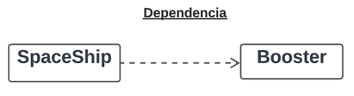

````java
public class SpaceShip {

    private folat moveSpeed = 2;

    public void applyBooster(Booster booster) { //<--- Usado como parámetro del método
        this.moveSpeed += booster.speedBoost;
    }
}
````

### Implementación (Realización)

Es usado para representar la implementación de interfaces. En el ejemplo mostramos que **SpaceShip es una implementación
concreta de IGameElement**:


````java
public interface IGameElement {
    void update();
}
````

````java
public class SpaceShip implements IGameElement {
    @override
    public void update() {

    }
}
````

### Herencia (Generalización)

Es usado para representar la herencia de clases.

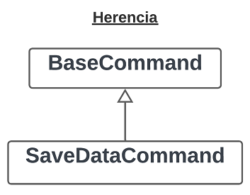

````java
public abstract class BaseCommand {
    void execute();
}
````

````java
public class SaveDataCommand extends BaseCommand {
    @override
    public void execute() {

    }
}
````

### [Clase anidada](https://holub.com/uml/)

[Version 2.1.5 UML] Podemos representar una clase **"interna (inner)"** cuya definición está anidada dentro de la
definición de clase **"externa (outer)"**:


---

# Patrones creacionales

- Proporcionan varios **mecanismos de creación de objetos** que incrementan la flexibilidad y la reutilización del
  código existente.
- **Definen cómo puede crearse un objeto. Habitualmente esto incluye aislar los detalles de la creación del objeto**, de
  forma que su código no dependa de los tipos de objeto que hay y, por lo tanto, no deba ser modificado al añadir un
  nuevo tipo de objeto.

---

## Singleton

- Permite asegurarnos de que **la clase tenga una única instancia** a la vez que proporciona un punto de acceso global a
  dicha distancia.

A continuación se muestra la estructura del patrón **Singleton**:

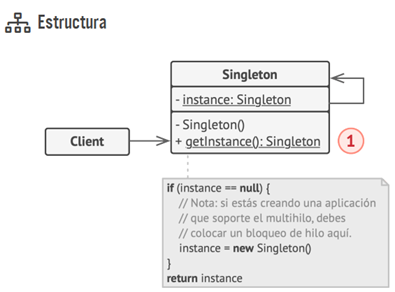

1. La clase `Singleton` declara el método estático `obtenerInstancia` que devuelve la misma instancia de su propia
   clase. El constructor del Singleton debe ocultarse del código cliente. La llamada al método `obtenerInstancia` debe
   ser la única manera de obtener el objeto Singleton.

### [Singleton en Java, todos los escenarios](https://javatechonline.com/singleton-design-pattern-in-java-with-all-scenarios/)

En el diagrama anterior mostramos la estructura general del patrón `Singleton`, pero en el mundo real nos encontraremos
con escenarios donde se requiera una implementación particular en función a dichos escenarios. Veamos cuáles son:

- Inicialización Ansiosa
- Bill Pugh (Inner Class)
- MultiThread

## Factory Method

Define una interfaz para crear un objeto, pero deja que las subclases decidan qué clase instanciar.


Factory Method es un patrón de diseño creacional que proporciona una interfaz para crear objetos en una superclase,
mientras permite a las subclases alterar el tipo de objetos que se crearán.


### Ejemplo de Refactoring.guru:


La finalidad del patrón Factory Method es proporcionar una manera de crear objetos de diferentes tipos sin tener que
conocer los detalles específicos de su creación. Aunque puede parecer que se están agregando más clases, en realidad
este enfoque tiene varios beneficios:

1. **Desacoplamiento:** El Factory Method permite separar la creación de objetos de su uso. Esto significa que el
   cliente (quien necesita los objetos) no necesita conocer los detalles concretos de cómo se crean los objetos. Si en
   el futuro cambias la forma en que se crean los objetos, el cliente no se verá afectado siempre y cuando mantengas la
   misma interfaz.

2. **Abstracción:** Al trabajar con interfaces y clases abstractas para la creación y los productos, puedes proporcionar
   una capa de abstracción que facilita la expansión y mantenimiento del sistema. Puedes agregar nuevos tipos de
   productos y creadores sin afectar el código existente.

3. **Reusabilidad:** Al tener creadores separados para diferentes tipos de objetos, puedes reutilizar la lógica de
   creación en varios lugares dentro de tu aplicación. Si necesitas crear objetos similares en diferentes partes del
   sistema, puedes utilizar los mismos creadores.

4. **Flexibilidad:** El Factory Method te permite crear jerarquías de productos y creadores. Esto es especialmente útil
   cuando tienes productos relacionados que deben ser creados de manera coherente, pero también con variaciones en su
   implementación.

5. **Extensibilidad:** Si en el futuro necesitas agregar nuevos tipos de productos, puedes hacerlo creando una nueva
   clase concreta de producto y un correspondiente creador. Esto evita la necesidad de modificar el código existente.

## Builder

- Construye objetos complejos con opciones de representación flexibles.
- **Separa la construcción de un objeto complejo de su representación** para que un mismo proceso de construcción pueda
  **crear diferentes representaciones.**
- **Permite construir objetos complejos paso a paso**. El patrón nos permite **producir distintos tipos y
  representaciones de un objeto** empleando el mismo código de construcción.
- La idea detrás del patrón **Builder es poder construir estructuras complejas paso a paso**. De manera que podemos
  utilizar diferentes tipos y representaciones de un objeto haciendo uso de la misma construcción.

Estructura del **patrón Builder:**


Aquí se muestra la **estructura más detallada:**


1. La interfaz constructora `Builder` declara pasos de construcción del producto que todos los tipos de objetos
   constructores tienen en común.
2. Los `Constructores concretos` ofrecen distintas implementaciones de los pasos de construcción. Los constructores
   concretos pueden crear productos que no siguen la interfaz común.
3. Los `Productos` son objetos resultantes. Los productos construidos por distintos objetos constructores no tienen que
   pertenecer a la misma jerarquía de clase o interfaz.
4. La clase `Directora` define el orden en el que se invocarán los pasos de construcción, por lo que puedes crear y
   reutilizar configuraciones específicas de los productos.
5. El `Cliente` debe asociar uno de los objetos constructores con la clase directora.

**NOTA**
> **No es estrictamente necesario tener una clase directora** en el programa, ya que se pueden invocar los pasos de
> construcción en un orden específico directamente desde el código del cliente. No obstante, la clase directora puede
> ser un buen lugar donde colocar distintas rutinas de construcción para poder reutilizarlas a lo largo del programa.

### Ejemplo de Refactoring Guru


### [Ejemplo de Tutoriales Java - Enfoque 1](https://www.digitalocean.com/community/tutorials/builder-design-pattern-in-java)

Según la página
de [java tutoriales](https://www.javatutoriales.com/2022/03/patron-de-diseno-builder.html#google_vignette), existen
distintos enfoques del patrón Builder. En esta oportunidad mostramos el primer enfoque que hace referencia a la
estrategia B de la página Java Tutoriales, pero el ejemplo se tomó de la página de **DigitalOcean**:

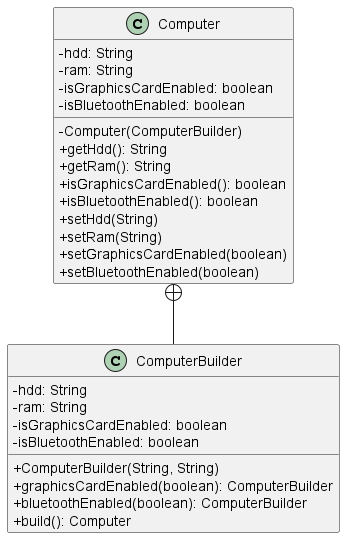

El cliente usará la implementación del diagrama anterior de la siguiente manera:

````java
public class Main {
    public static void main(String[] args) {
        Computer computer = new Computer.ComputerBuilder("1TB", "16GB")
                .graphicsCardEnabled(true)
                .bluetoothEnabled(true)
                .build();
        System.out.println(computer);
    }
}
// Computer{hdd='1TB', ram='16GB', isGraphicsCardEnabled=true, isBluetoothEnabled=true}
````

**NOTA**

El diagrama de clases anterior fue generada usando código de **[PlantUML](https://plantuml.com/es/class-diagram)**,
luego ejecutando el comando `java -jar plantuml.jar nombre_archivo.puml`. Previamente, debemos haber descargado el
archivo `plantuml.jar` y creado el archivo con extensión `pu` o `puml` donde colocaremos el código de `PlantUML`.

### [Ejemplo de Tutoriales Java - Enfoque 2](https://www.javatutoriales.com/2022/03/patron-de-diseno-builder.html#google_vignette)

Este enfoque es similar al enfoque anterior, la diferencia es que en este enfoque ambos clases tienen sus
`constructores privados` con la finalidad de que el cliente evite usar el `new` para la creación de objetos del tipo
User. Otra diferencia notoria es que en este segundo enfoque usamos un **método estático** que retorna una instancia de
la clase constructora.

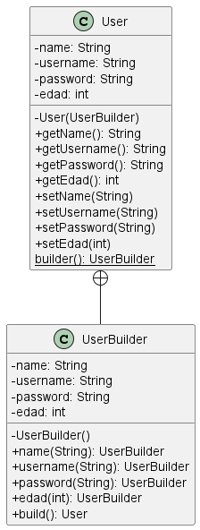

El cliente usará la implementación del diagrama anterior de la siguiente manera:

````java
public class Main {
    public static void main(String[] args) {
        User user = User.builder()
                .name("Nophy")
                .username("dog")
                .password("12345")
                .edad(4)
                .build();
        System.out.println(user);
    }
}
//User{name='Nophy', username='dog', password='12345', edad=4}
````

Es importante volver a precisar que en este segundo enfoque **NO se podrá crear una instancia de User de esta manera**:

````
[X] User user = new User.UserBuilder()...
````

Esto es porque precisamente definimos el constructor del `UserBuilder()` como privado. Entonces, la única manera de
crear una instancia de `UserBuilder` y con él crear la instancia de `User` **es a través del método estático de
la clase User, el builder()**.

### [Ejemplo de GustavoPeiretti](https://gustavopeiretti.com/patron-de-diseno-builder-en-java/)

Este ejemplo se asemeja más al desarrollado por **refactoring.guru**:

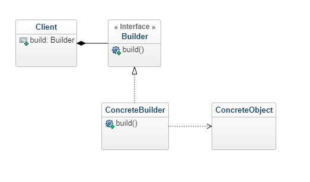

El cliente que quiere crear una instancia de `BankAccount` deberá instanciar la clase constructora `BankAccountBuilder`:

````java
public class Main {
    public static void main(String[] args) {
        BankAccount b2 = new BankAccountBuilder(12345L)
                .balance(1000.20)
                .owner("Oaken")
                .interestRate(10.5)
                .type("PLATINIUM")
                .build();
        System.out.println(b2);
    }
}
````

---

# Patrones estructurales

- Explican **cómo ensamblar objetos y clases en estructuras más grandes**, a la vez que se mantiene la flexibilidad y
  eficiencia de esas estructuras.
- Tratan la manera en que los objetos se conectan con otros objetos, para asegurar que los cambios del sistema no
  requieren cambiar esas conexiones.
- Determinar cómo las clases y objetos se combinan para formar estructuras. Estas estructuras permitirán que se agreguen
  nuevas funcionalidades.
- Se centran en la composición de las clases y la forma en que se relacionan entre sí para formar estructuras más
  complejas. Los patrones de diseño estructural ayudan a lograr una mayor flexibilidad, reutilización y mantenibilidad
  del código.

---

## Adapter

- Permite la colaboración entre objetos con interfaces incompatibles.
- Convierte la interfaz de una clase en otra interfaz que los clientes esperan.
- El patrón de diseño Adapter es utilizado cuando tenemos interfaces de software incompatibles, las cuales a pesar de su
  incompatibilidad tiene una funcionalidad similar. Este patrón es implementado cuando se desea homogeneizar la forma de
  trabajar con estas interfaces incompatibles, para lo cual se crea una clase intermedia que funciona como un adaptador.
  Esta clase adaptador proporcionará los métodos para interactuar con la interface incompatible.

Estructura del **patrón Adapter:**


Aquí se muestra la estructura más detallada:

1. La clase `Cliente` contiene la lógica de negocio existente del programa.
2. La `Interfaz con el Cliente` describe un protocolo que otras clases deben seguir para poder colaborar con el código
   cliente.
3. `Servicio` es alguna clase útil (normalmente de una tercera parte o heredada). El cliente no puede utilizar
   directamente esta clase porque tiene una interfaz incompatible.
4. La clase `Adaptadora` es capaz de trabajar tanto con la clase cliente como con la clase de servicio: implementa la
   interfaz con el cliente, mientras envuelve el objeto de la clase de servicio. La clase adaptadora recibe llamadas del
   cliente a través de la interfaz adaptadora y las traduce en llamadas al objeto envuelto de la clase de servicio, pero
   en un formato que pueda comprender.
5. El código cliente no se acopla a la clase adaptadora concreta siempre y cuando funcione con la clase adaptadora a
   través de la interfaz con el cliente. Gracias a esto, puedes introducir nuevos tipos de adaptadores en el programa
   sin descomponer el código cliente existente. Esto puede resultar útil cuando la interfaz de la clase de servicio se
   cambia o sustituye, ya que puedes crear una nueva clase adaptadora sin cambiar el código cliente.


### Ejemplo de Refactoring Guru

Este ejemplo del patrón `Adapter` se basa en el clásico conflicto entre piezas cuadradas y agujeros redondos.

El patrón Adapter finge ser una pieza redonda con un radio igual a la mitad del diámetro del cuadrado (en otras
palabras, el radio del círculo más pequeño en el que quepa la pieza cuadrada).


### Ejemplo de Arquitectura Java

El patrón adaptador se encargará de construir una clase que adapte la funcionalidad de la clase LamparaInglesa de
tal forma que se pueda usar dentro de nuestra estructura de conectables.

El uso de Java Adapter pattern nos puede ayudar a solventar muchas situaciones de programación compleja en donde tenemos
que integrar código de distintos desarrolladores.


## Decorator

- **Añade dinámicamente un nuevo comportamiento a un objeto** en tiempo de ejecución envolviéndolo en un objeto de una
  clase decoradora.
- Mejora dinámicamente la funcionalidad de los objetos.
- Añade responsabilidades adicionales a un objeto de forma dinámica.
- Permite añadir funcionalidades a objetos colocando estos objetos dentro de objetos encapsuladores especiales que
  contienen estas funcionalidades.

Estructura del patrón **Decorator**:

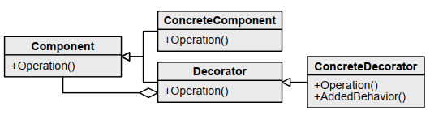

Aquí se muestra la estructura más detallada:

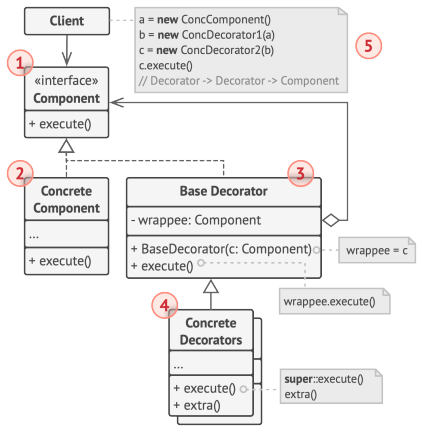

1. **El componente** declara la interfaz común tanto para wrappers como para objetos envuetos.
2. **Componente Concreto** es una clase de objetos envueltos. Define el comportamiento básico, que los decoradores
   pueden alterar.
3. La clase **Decoradora Base** tiene un campo para referenciar un objeto envuelto. El tipo del campo debe declararse
   como la interfaz del componente para que pueda contener tanto los componentes concretos como los decoradores. La
   clase decoradora base delega todas las operaciones al objeto envuelto.
4. Los **Decoradores Concretos** definen funcionalidades adicionales que se pueden añadir dinámicamente a los
   componentes. Los decoradores concretos sobreescriben métodos de la clase decoradora base y ejecutan su
   comportamiento, ya sea antes o después de invocar al método padre.
5. **El Cliente** puede envolver componentes en varias capas de decoradores, siempre y cuando trabajen con todos los
   objetos a través de la interfaz del componente.

### Ejemplo de Refactoring Guru

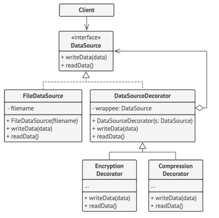

Este ejemplo muestra **cómo puedes ajustar el comportamiento de un objeto sin cambiar su código.**

Inicialmente, la clase de la lógica de negocio solo podía leer y escribir datos en texto sin formato. Después **creamos
varias pequeñas clases envoltorio que añaden un nuevo comportamiento** tras ejecutar operaciones estándar en un objeto
envuelto.

El **primer wrapper codifica y decodifica información**, y el **segundo comprime y descomprime datos.**

Puedes incluso combinar estos wrappers envolviendo un decorador con otro.

### [Ejemplo de Codejavu](http://codejavu.blogspot.com/2013/07/ejemplo-patron-de-diseno-decorator.html)

**El problema**. Un restaurante de comidas rápidas ofrece 3 tipos de combos (Combo Básico, Combo Familiar, Combo
Especial) cada combo tiene características diferentes en cuanto a cantidad, porciones, salsas entre otros, el
restaurante también ofrece la posibilidad de aumentar el pedido mediante diferentes porciones adicionales (Tomate,
Papas, Carne, Queso), se desea crear un sistema de pedidos que permita al usuario seleccionar el combo deseado, así como
armar su propio pedido con las porciones adicionales, el sistema deberá informar sobre el pedido del usuario y el valor
total del mismo.


## Proxy

- Proporciona un sustituto o marcador de posición para otro objeto con el fin de controlar el acceso a él.
- Un proxy controla el acceso al objeto original, permitiéndole hacer algo antes o después de que la solicitud llegue al
  objeto original.
- Se basa en proporcionar un objeto que haga de intermediario (proxy) de otro, para controlar el acceso a él.

Estructura del patrón **Proxy:**

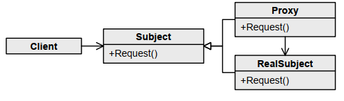

Aquí se muestra la estructura más detallada:

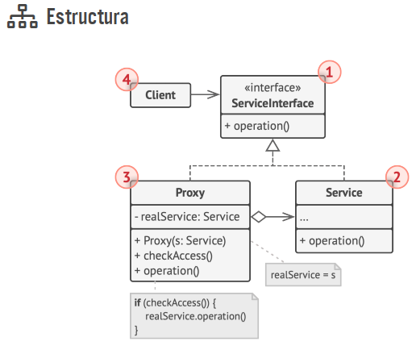

1. La `Interfaz de Servicio` declara la interfaz del Servicio. El proxy debe seguir esta interfaz para poder camuflarse
   como objeto de servicio.
2. `Servicio` es una clase que proporciona una lógica de negocio útil.
3. La clase `Proxy` tiene un campo de referencia que apunta a un objeto de servicio. Cuando el proxy finaliza su
   procesamiento (por ejemplo, inicialización diferida, registro, control de acceso, almacenamiento en caché, etc.),
   pasa la solicitud al objeto de servicio. Normalmente, los proxies gestionan el ciclo de vida completo de sus objetos
   de servicio.
4. El `Cliente` debe funcionar con servicios y proxies a través de la misma interfaz. De este modo, puedes pasar un
   proxy a cualquier código que espere un objeto de servicio.

### Ejemplo de Refactoring Guru: "Proxy de caché"

En este ejemplo, el `patrón Proxy` ayuda a implementar la inicialización diferida y el almacenamiento en caché a una
ineficiente biblioteca de integración de Youtube de un tercero.

Proxy es muy valioso cuando tienes que añadir comportamientos a una clase cuyo código no puedes cambiar.

### Ejemplo de Digital Ocean

El patrón de diseño proxy se utiliza cuando queremos proporcionar un acceso controlado a una funcionalidad. Digamos que
tenemos una clase que puede ejecutar algún comando en el sistema. Ahora bien, si la estamos utilizando, está bien, pero
si queremos dar este programa a una aplicación cliente, puede tener graves problemas porque el programa cliente puede
emitir comandos para eliminar algunos archivos del sistema o cambiar algunos ajustes que no queremos. Aquí una clase
proxy puede ser creada para proveer acceso controlado al programa.

## Facade

- **Proporciona una interfaz simplificada** a una biblioteca, un framework o cualquier otro grupo complejo de clases.
- Proporciona una interfaz unificada para un conjunto de interfaces de un subsistema. Define una interfaz de alto nivel
  que hace que el subsistema sea más fácil de usar.
- Nos permite acceder a un subsistema de forma más sencilla.

Estructura del patrón **Facade**:

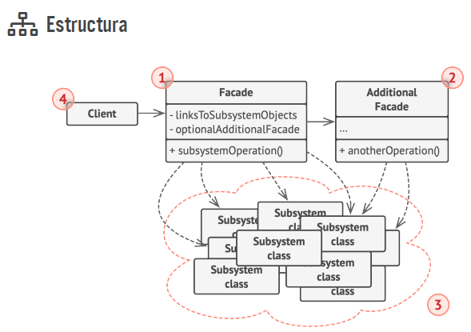

1. El patrón `facade` proporciona un práctico acceso a una parte específica de la funcionalidad del subsistema. Sabe a
   dónde dirigir la petición del cliente y cómo operar todas las partes móviles.
2. Puede crearse una clase `fachada adicional` para evitar contaminar una única fachada con funciones no relacionadas
   que podrían convertirla en otra estructura compleja. Las fachadas adicionales pueden utilizarse por clientes y por
   otras fachadas.
3. El `subsistema complejo` consiste en decenas de objetos diversos. Para lograr que todos hagan algo significativo,
   debes profundizar en los detalles de implementación del subsistema, que pueden incluir inicializar objetos en el
   orden correcto y suministrarles datos en el formato adecuado. Las clases del subsistema no conocen la existencia de
   la fachada. Operan dentro del sistema y trabajan entre sí directamente.
4. El `cliente` utiliza la fachada en lugar de invocar directamente los objetos del subsistema.

### Ejemplo de Refactoring Guru: "Interfaz simple para una biblioteca compleja de conversión de video"

En este ejemplo, el patrón Facade simplifica la comunicación con un framework complejo de conversión de video.

El patrón Facade proporciona una única clase con un único método que gestiona toda la complejidad de configurar las
clases correctas del framework y recuperar el resultado en el formato correcto.

### Ejemplo de Digital Ocean

Supongamos que tenemos una aplicación con un conjunto de interfaces para utilizar bases de datos MySql/Oracle y generar
diferentes tipos de informes, como informes HTML, informes PDF, etc. Así que tendremos diferentes conjuntos de
interfaces para trabajar con diferentes tipos de bases de datos. Ahora una aplicación cliente puede utilizar estas
interfaces para obtener la conexión de base de datos requerida y generar informes. Pero cuando la complejidad aumenta o
los nombres de comportamiento de la interfaz son confusos, la aplicación cliente tendrá dificultades para gestionarlo.
Así que podemos aplicar el patrón de diseño Facade aquí y proporcionar una interfaz de envoltura en la parte superior de
la interfaz existente para ayudar a la aplicación cliente.

---

# Patrones de comportamiento

- Tratan con algoritmos y la asignación de responsabilidades entre los objetos.
- Tratan a los objetos que manejan tipos particulares de acciones dentro de un programa. Estos encapsulan procesos debe
  ejecutarse dentro de la funcionalidad de la aplicación, como interpretar un lenguaje, completar una petición, moverse
  a través de una secuencia o implementar un algoritmo.
- El patrón de comportamiento se ocupa de la comunicación entre objetos de clase.
- Definen las **interacciones y responsabilidades de los objetos.**
- Se utilizan para definir **cómo los objetos interactúan y se comunican entre sí.** Abordan la asignación de
  responsabilidades y flujos de control.

---

## Strategy

- Encapsula algoritmos intercambiables para un uso flexible basado en los requisitos del cliente.
- Define una familia de algoritmos, encapsula cada uno y los hace intercambiables.
- Permite definir una familia de algoritmos, colocar cada uno de ellos en una clase separada y hacer sus objetos
  intercambiables.
- Permite a una clase cambiar su comportamiento en tiempo de ejecución. Esto se logra mediante la creación de diferentes
  estrategias o algoritmos que pueden ser intercambiados fácilmente.

Estructura del patrón **Strategy:**

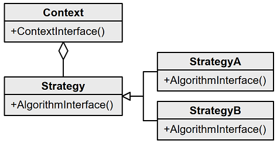

Aquí se muestra la estructura más detallada:

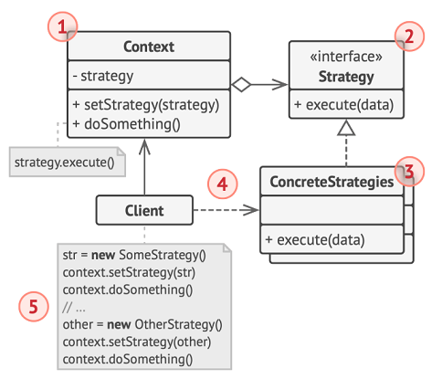

1. **La clase contexto** mantiene una referencia a una de las estrategias concretas y se comunica con este objeto
   únicamente a través de la interfaz estrategia.
2. **La interfaz estrategia** es común a todas las estrategias concretas. Declara un método que la clase contexto
   utiliza para ejecutar una estrategia.
3. **Las estrategias concretas** implementan distintas variaciones de un algoritmo que la clase contexto utiliza.
4. **La clase contexto** invoca el método de ejecución en el objeto de estrategia vinculado cada vez que necesita
   ejecutar el algoritmo. La clase contexto no sabe con qué tipo de estrategia funciona o cómo se ejecuta el algoritmo.
5. **El cliente** crea un objeto de estrategia específico y lo pasa a la clase contexto. La clase contexto expone un
   modificador `set()` que permite a los clientes sustituir la estrategia asociada al contexto durante el tiempo de
   ejecución.

### Ejemplo de Refactoring Guru: "Medios de pago en una aplicación de comercio electrónico"

En este ejemplo, el patrón Strategy se utiliza para implementar los distintos medios de pago de una aplicación de
comercio electrónico. Una vez seleccionado el producto a comprar, un cliente elige un medio de pago: Paypal o tarjeta de
crédito.

Las estrategias concretas no solo realizan el propio pago, sino que además alteran el comportamiento del formulario de
pago, proporcionando campos adecuados para el registro de los datos del pago.

**Aplicabilidad**

> Utiliza el patrón **Strategy** cuando quieras utilizar **distintas variantes de un algoritmo** dentro de un objeto y
> poder cambiar de un algoritmo a otro durante **el tiempo de ejecución.**
>
> Utiliza el patrón **Strategy** cuando tengas muchas **clases similares** que solo **se diferencien** en la forma en
> que **ejecutan cierto comportamiento.**

### [Ejemplo de DigitalOcean: "Medios de pago"](https://www.digitalocean.com/community/tutorials/strategy-design-pattern-in-java-example-tutorial)

El patrón estratégico también se conoce como patrón político. Definimos múltiples algoritmos y dejamos que la aplicación
cliente pase el algoritmo para usarlo como parámetro. Para nuestro ejemplo, **intentaremos implementar un carrito de
compras simple donde tenemos dos estrategias de pago: usar tarjeta de crédito o PayPal. En primer lugar, crearemos la
interfaz para nuestro ejemplo de patrón de estrategia, en nuestro caso para pagar la cantidad pasada como argumento.**

Será una implementación similar a la que hicimos en el ejemplo de **Refactoring Guru**, pero en este caso mostraremos
su diagrama de clases:


**NOTA**

> Tenga en cuenta que el **método de pago del carrito de compras requiere un algoritmo de pago** `como argumento` y `no
> lo almacena en ningún lugar como variable de instancia.`
>
> Podríamos haber usado la composición para crear `variables de instancia` para estrategias, pero `deberíamos evitarlo`
> ya que queremos que la estrategia específica se aplique a una tarea particular.
>
> El patrón de estrategia es muy similar al patrón de estado. Una de las diferencias es que el contexto contiene el
> estado como variable de instancia y puede haber múltiples tareas cuya implementación puede depender del estado,
> mientras que `en el patrón de estrategia la estrategia se pasa como argumento al método y el objeto de contexto
> no tiene ninguna variable para almacenarlo.`

### [Ejemplo de DZone: "Formatos de compresión de archivos"](https://dzone.com/articles/design-patterns-strategy)

El patrón Estrategia `se debe utilizar donde desee elegir el algoritmo que se utilizará en tiempo de ejecución`. Un buen
uso del patrón Estrategia sería **guardar archivos en diferentes formatos, ejecutar varios algoritmos de clasificación
o compresión de archivos.**

El patrón Estrategia `proporciona una forma de definir una familia de algoritmos`, encapsular cada uno como un objeto y
hacerlos intercambiables.

## Template Method

- **Define el esqueleto de un algoritmo en la superclase**, pero permite que las subclases sobreescriban pasos del
  algoritmo sin cambiar su estructura.
- El método de plantilla divide el algoritmo en pasos, permitiendo a las subclases sobreescribir estos pasos **pero no
  sobreescribir el método de plantilla.**
- Define un esqueleto común para un algoritmo y dejar los detalles de implementación para los hijos.
- Con este patrón se define el esqueleto de un algoritmo en una clase abstracta, y se deja que sean las subclases
  quienes proporcionen los detalles concretos de algunos o todos los pasos de ese algoritmo. Lo interesante de este
  patrón es que también da la opción a las subclases de redefinir los pasos de acuerdo con sus necesidades, sin cambiar
  la estructura del algoritmo.

Estructura del patrón **Template Method:**

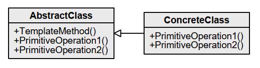

Aquí se muestra la estructura más detallada:

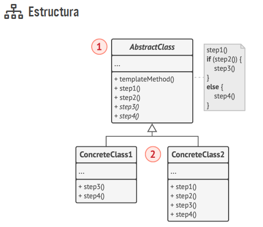

1. La `clase abstracta` declara métodos que actúan como pasos de un algoritmo, así como el propio método plantilla que
   invoca estos métodos en un orden específico. Los pasos pueden declararse `abstractos` o contar con una
   implementación por defecto.
2. Las `clases concretas` pueden sobreescribir todos los pasos, pero no el propio método plantilla.

### [Ejemplo de Digital Ocean: "Algoritmo para construir una casa"](https://www.digitalocean.com/community/tutorials/template-method-design-pattern-in-java)

**Patrón de diseño del Método de Plantilla**

El método de plantilla define los pasos para ejecutar un algoritmo y puede proporcionar una implementación
predeterminada que puede ser común para todas o algunas de las subclases. Entendamos este patrón con un ejemplo,
supongamos que queremos proporcionar un algoritmo para construir una casa. Los pasos que se deben seguir para construir
una casa son: construir los cimientos, construir los pilares, construir las paredes y las ventanas. El punto importante
es que no podemos cambiar el orden de ejecución porque no podemos construir ventanas antes de construir los cimientos.
Entonces, en este caso podemos crear un método de plantilla que utilizará diferentes métodos para construir la casa.
Ahora bien, construir los cimientos de una casa es lo mismo para todo tipo de casas, ya sea una casa de madera o una de
cristal. Entonces podemos proporcionar una implementación básica para esto, si las subclases quieren anular este método,
pueden hacerlo, pero principalmente es común para todos los tipos de casas. `Para asegurarnos de que las subclases no
anulen el método de plantilla, debemos hacerlo final.`

**Clase abstracta del método de Plantilla**

Como queremos que algunos de los métodos sean implementados por subclases, `tenemos que hacer que nuestra clase base sea
una clase abstracta.`

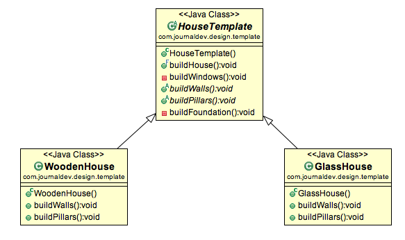

